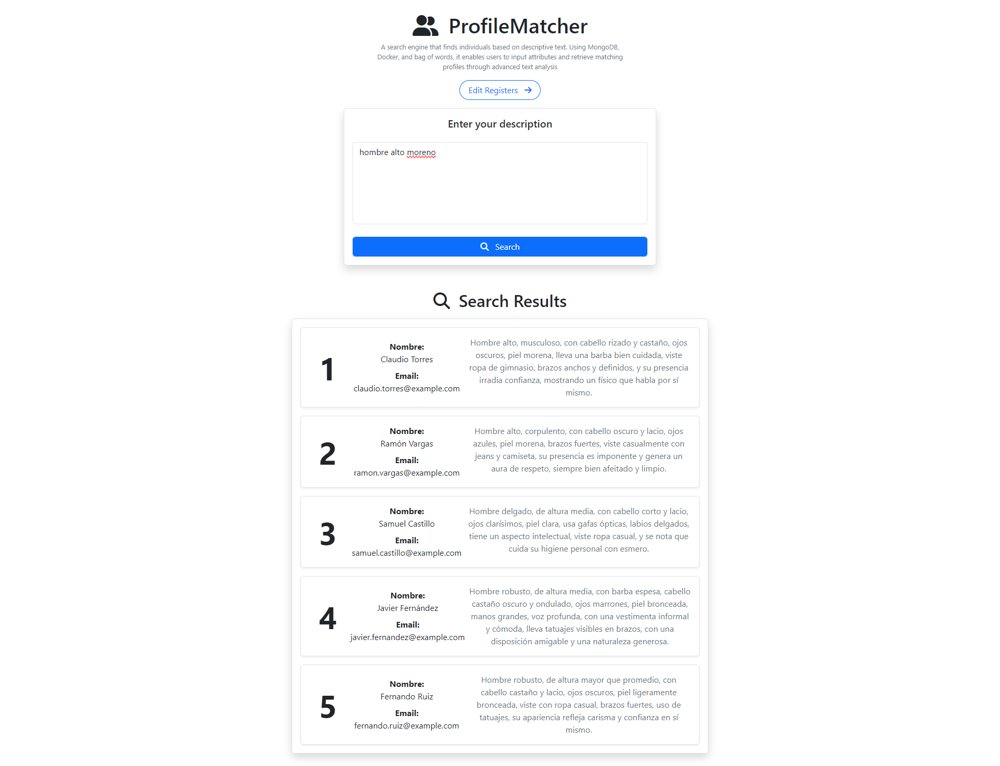
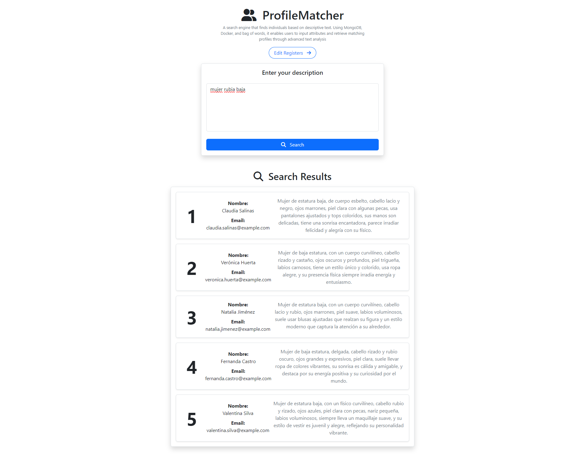
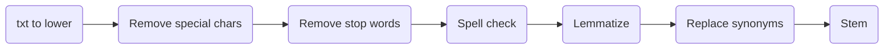

# ProfileMatcher: A semantic search engine

## How it works?
The program works by running a Docker container in Node.js. Node.js is responsible for adding, deleting, and updating the person descriptions, while Python handles finding the best match using bag of words and TF-IDF. Two servers are launched: one for Python and another for Node.js

## Preview



### Workflow
*Search Request*


*Process Text*


## How to use?
The project was developed using Docker To build the project, you need to run the following commands:

Build & Run the project:
```sh
npm run build
```

Run the project:
```sh
npm run start
```

Down the project:
```sh
npm run down
```

## Limitations
For lemmatization, we used a not-public API getted by web scraping from a Spanish linguistic [page](https://lenguaje.com), this is the [API](https://lenguaje.com/wp-json/lemmatizer/v1/).
The main problem is that the API is limited to **n** requests hourly, this can be solved by using a proxy, however in this project it was not implemeted.